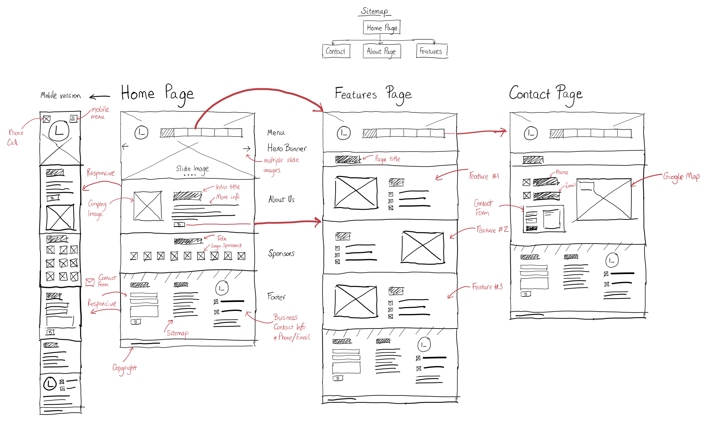

# Undirbúningur

Þegar byrjað er á að hanna vef þarf að skipuleggja innihald vefsins og hvernig samkskipti við notendur eiga að fara fram.

1. Forsíða (löndunarsíða (_Landing page_)
2. Dagskrá eða vörulýsing (_Features_)
4. Samskipti (_Contact_)
   * nýskráning 
   * innskráning 
   * viðskipti (_Buy - Order_)
5. Almennar upplýsingar (_About Us_)

## Leiðakerfi (_Site map_)

Hér er dæmi um leiðarkerfi (_Navigation_) fyrir vef sem er með rit- og umsjónarkerfi (_CMS Content Management System_). Við erum ekki að fara hanna svona flókinn vef en við getum haft hann til fyrirmyndar fyrir vefinn okkar.

## Tengirammi (_Wireframe_)

Næsta skref er að teikna upp skipulag á blaði sem sýnir aðeins staðsetningu efnis á skjá, texti og myndir eru skilgreind sem box. 

## Frumgerð í Inkscape (_Prototype_)

Síðan útfærum við teikninguna yfir í Inkscape og höfum tóma ramma fyrir myndir og dummy texta (_Lorem Ipsum..._). Hér er einnig hægt að ákveða hvaða grunnlitir eru notaðir í vefnum, tákn og leturgerðir.

Við búum til Inkscape skjöl sem eru sett upp í mismunandi stærðum og höfum stærð þeirra með sömu breidd og algengar skjástærðir eru. Við stillum einingamál Inkscape í **Pixel**.

Hér er upptalning á stærðum sem hægt er að nota (Það dugar að velja annað hvort Galaxy eða iPhone skjástærðina). 

1. Farsímar - lóðrétt staða (_Portrait_)
   * 360 x 2000 (skjástærð 360 x 640 - Galaxy S5) 
   * 375 x 2000 (skjástærð 375 x 667 - iPhone 6/7/8)

2. Farsímar - lárétt staða (_Landscape_)
   * 640 x 2000 (skjástærð 640 x 360 - Galaxy S5) 
   * 667 x 2000 (skjástærð 667 - 375 iPhone 6/7/8)

3. Spjaldtölvur lóðrétt staða (_Portrait_)
   * 760 x 2000 (skjástærð 760 - 1024 iPad) 

4. Spjaldtölvur lárétt staða (_Landscape_)
   * 1024 x 2000 (skjástærð 1024 - 760 iPad) 

5. Fartölvur 
   * 1280 x 2000 (skjástærð 1280 - 1024) 

6. Fartölvur og borðtölvur
   * 1600 x 2000 (skjástærð 1600 - 1050) 

[Bjargir](https://github.com/vefhonnun/21V/wiki/Bjargir#skipulagning-og-h%C3%B6nnun)