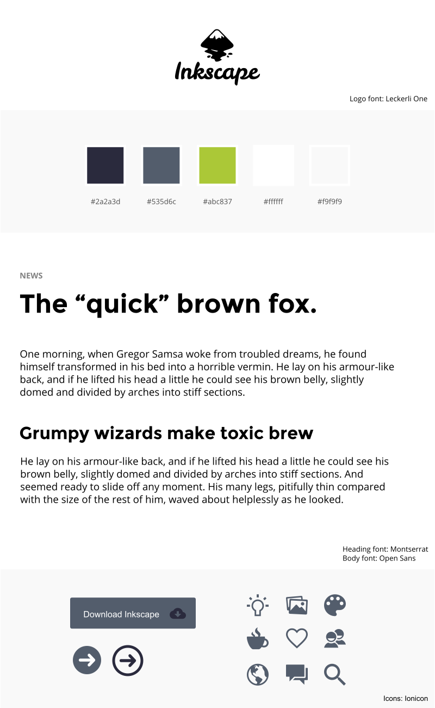
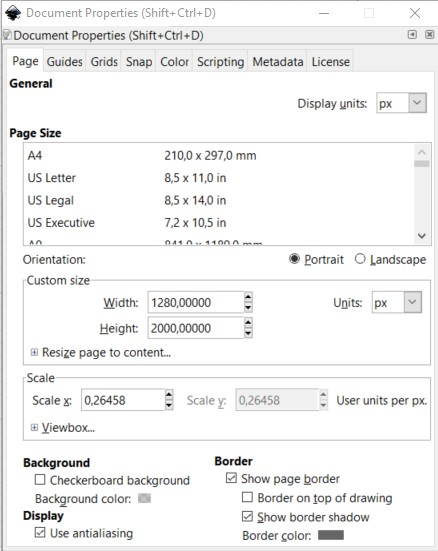
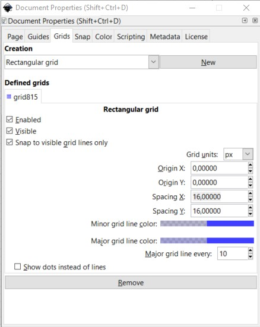

# Frumgerð í Inkscape (_Prototype_)

Við höfum tengirammann til hliðsjónar við að búa til frumgerð. Inkscape teikniforritið hentar vel til að búa til frumgerð að litlum vef. Hér er hægt að ákveða hvaða grunnlitir eru notaðir í vefnum, tákn og leturgerðir. Innihald vefsins  er sýnt sem tómir myndarammar og dummy texti (_Lorem Ipsum..._). 

Við búum til Inkscape skjöl sem eru sett upp í mismunandi stærðum og höfum stærð þeirra með sömu breidd og algengar skjástærðir eru. Við stillum einingamál Inkscape í **Pixel**.

Hér er upptalning á stærðum sem hægt er að nota í Inkscape

1. Farsímar - lóðrétt staða (_Portrait_)
   * 360 x 2000 (skjástærð 360 x 640 - Galaxy S5) 

2. Farsímar - lárétt staða (_Landscape_)
   * 640 x 2000 (skjástærð 640 x 360 - Galaxy S5) 

3. Spjaldtölvur lóðrétt staða (_Portrait_)
   * 760 x 2000 (skjástærð 760 - 1024 - iPad) 

4. Spjaldtölvur lárétt staða (_Landscape_)
   * 1024 x 2000 (skjástærð 1024 - 760 iPad) 

5. Fartölvur 
   * 1280 x 2000 (skjástærð 1280 - 1024) 

6. Fartölvur og borðtölvur
   * 1600 x 2000 (skjástærð 1600 - 1050) 

## Grid - 16px = 1em

Til að auðvelda endanlega hönnun er skynsamlegt að nota sömu grunn eininguna 16px (1em) og er notuð í vefsíðugerð. Í Inkscape stillum við Grid eins og sýnt er hér á mynd.

Með 16px grid er auðvelt að skilgreina stærðir.

[Bjargir](https://github.com/vefhonnun/21V/wiki/Bjargir#skipulagning-og-h%C3%B6nnun)